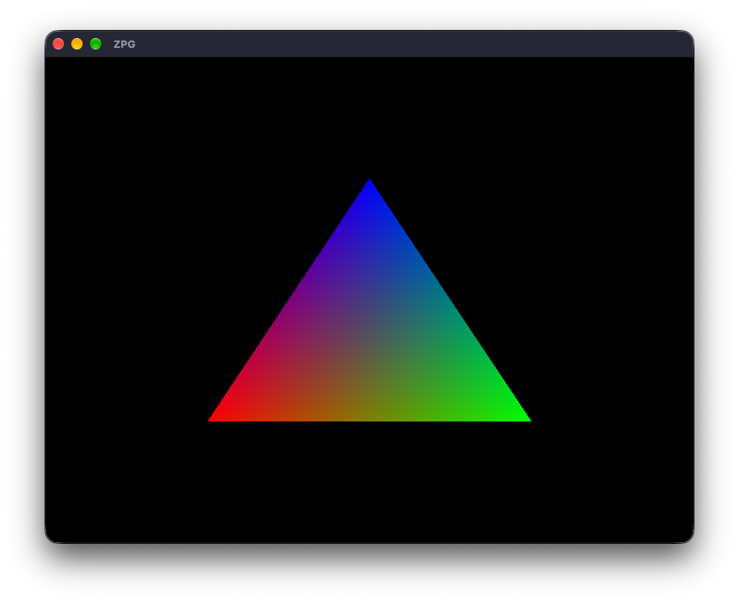
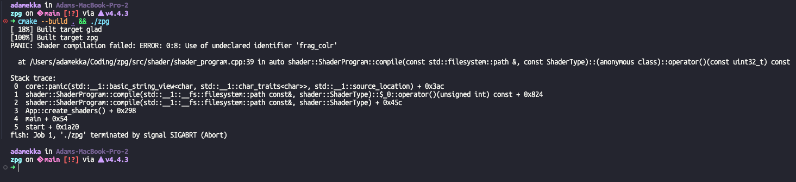
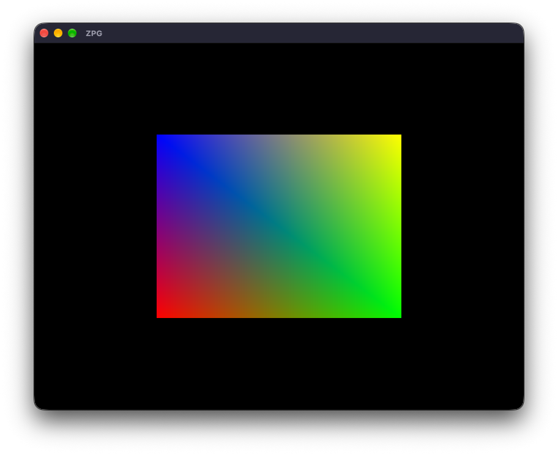
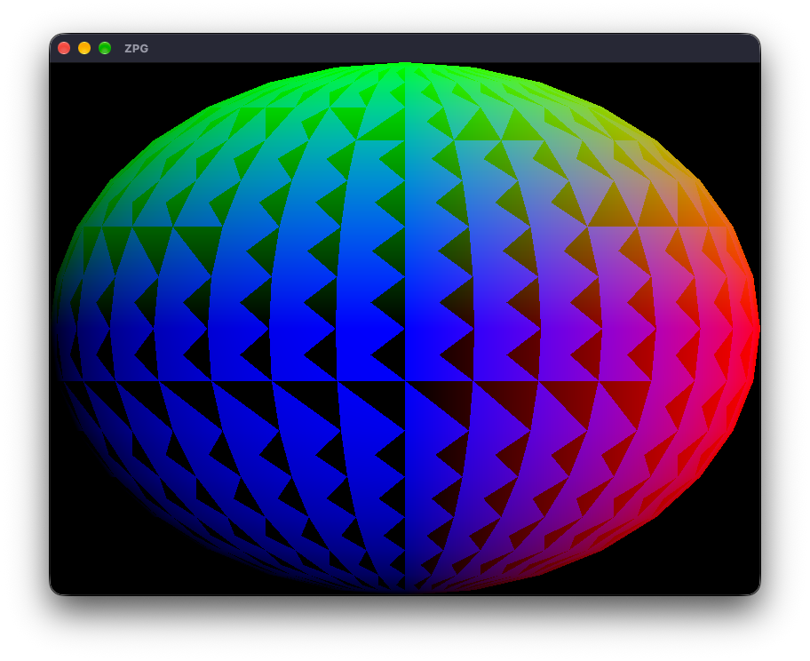
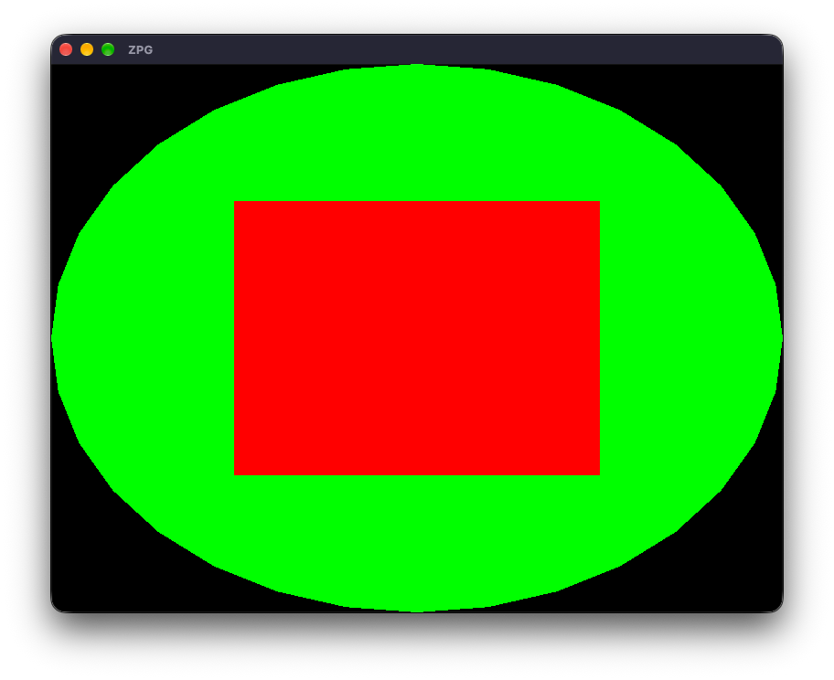

# Cvičení 2

## 1. Programovatelná pipeline

Splněno

Řekl jsem shader programu, ať zkompiluje shadery, nadefinoval, kde mají být vrcholy, a vidím trojúhelník na monitoru.

V LMS je instance třídy Application na heapu. To není potřeba, tak jsem ji nechal na stacku. Předpokládám, že budeme vytvářet jenom jednu aplikaci během běhu programu, tak jsem z ní udělal singleton.

## 2. Chyba v shaderu

Splněno

Na nezotavitelné chyby používám `core::panic()`, protože ukazuje, kde se chyba stala, a vrací stack trace.

## 3. Trojúhelník

Splněno

Pouze jsem přidal jeden vrchol do konstruktoru `object::mesh::Mesh{}`. Abstrakce se sama stará o počet vrcholů a nemusel jsem měnit argument funkce `glDrawArrays()`.
Také jsem využil `GL_TRIANGLE_STRIP`, abych nemusel definovat 6 vrcholů, ale jenom 4.

## 4. Model z pole hodnot typu float

Splněno

Využil jsem factory funkci `object::mesh::Mesh::from_raw_data()` pro převedení pole hodnot typu float na `object::mesh::Mesh`.

## 5. Více modelů, více shader programů

Splněno

Koule v pozadí má fragment shader, který nastavuje barvu na zelenou. Čtverec v popředí má fragment shader, který nastavuje barvu na červenou.

## 6. Relativní cesty

Splněno v `CMakeLists.txt`
