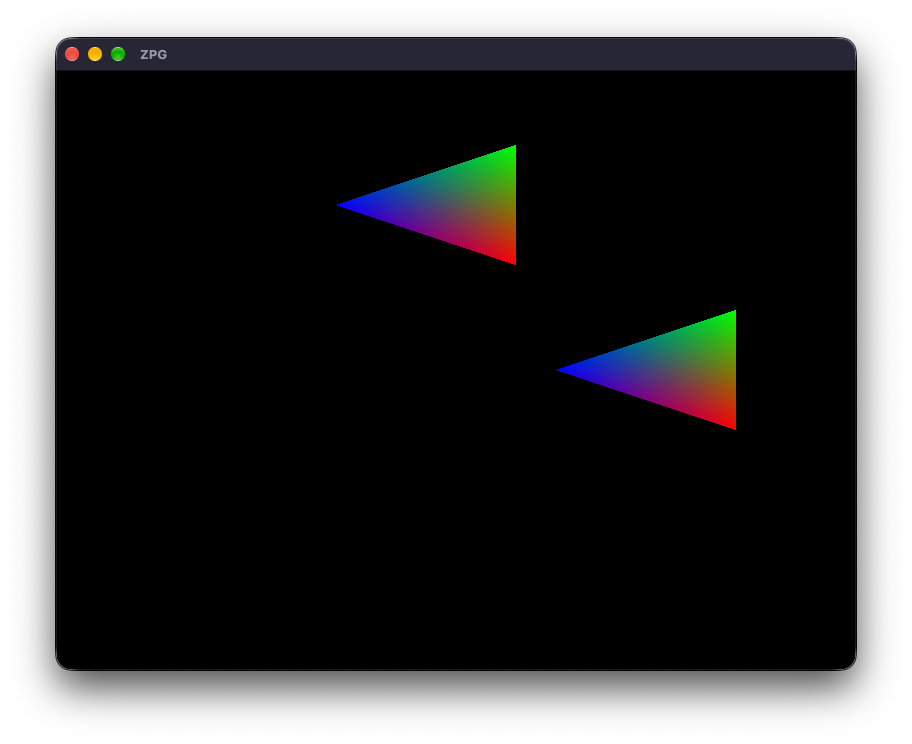
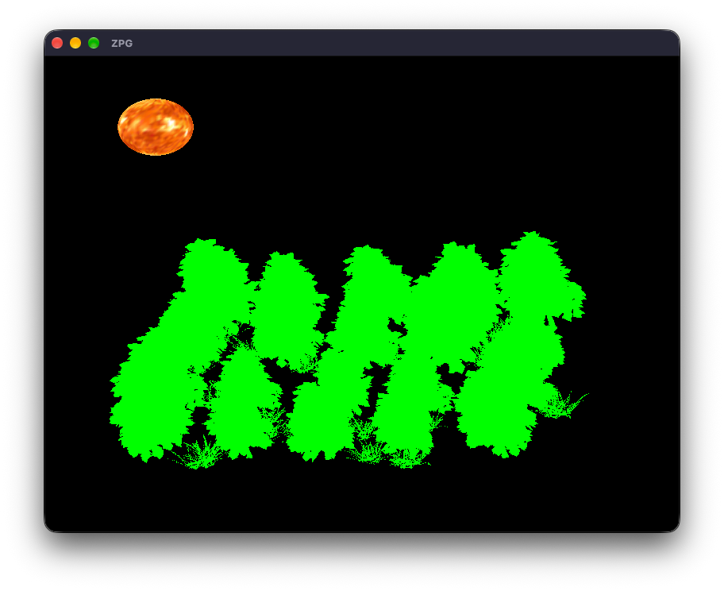
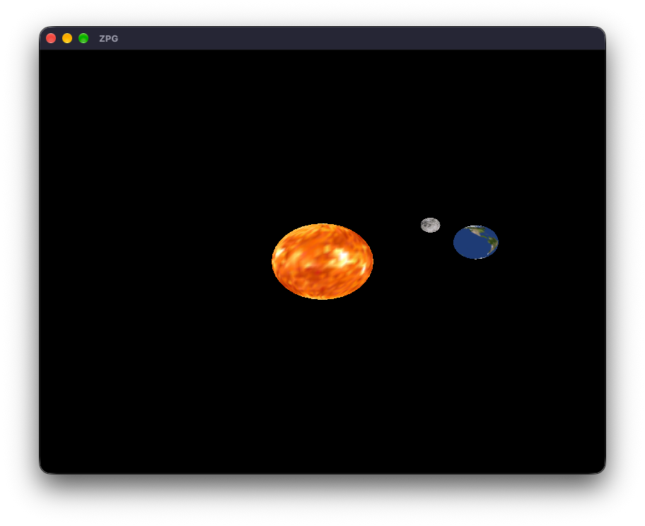

# Cvičení 2

## 1

Splněno.

`DrawableObject` má jeden `Transform`, který se vytváří z pozice, rotace X/Y/Z a měřítka.
`Transform` umožňuje kombinovat transformace a modelovou matici vytváří uvnitř.
Shader `basic.vert` transformuje pozice pomocí modelové matice.

## 2

Splněno.

## 3

Splněno.

## 4

Rotace a následný posun umístí trojúhelník vpravo.
Při opačném pořadí skončí nahoře, protože se otočí i směr posunu.
Pořadí transformací tedy ovlivňuje výsledek.

## 5

Posun, rotace, měřítko a složené transformace splňují koncept `Component`.
`CompositeTransform` ukládá jednotlivé transformace pomocí `std::variant` a skládá modelové matice.

## 6

Splněno.

## 7

Splněno.

Země se otáčí kolem své osy a zároveň obíhá kolem Slunce.
U Měsíce se nejprve nastaví velikost a vzdálenost od Země, potom se přidá jeho oběh kolem Země.
Nakonec se připojí oběh Země kolem Slunce, takže se Měsíc pohybuje společně se Zemí.

