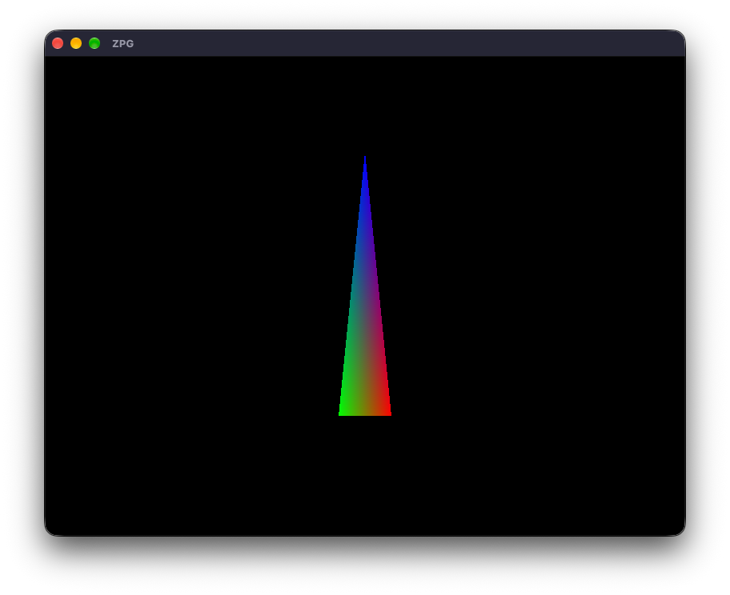
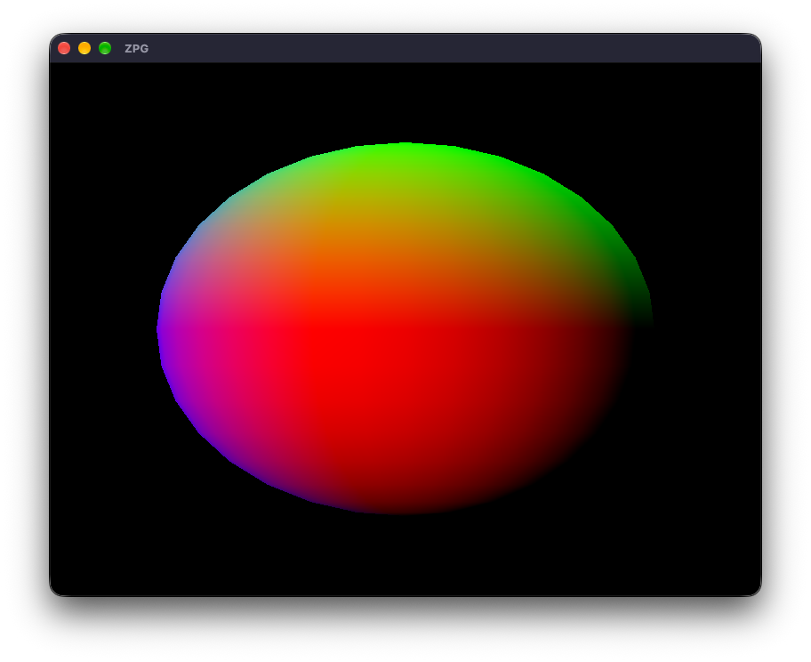
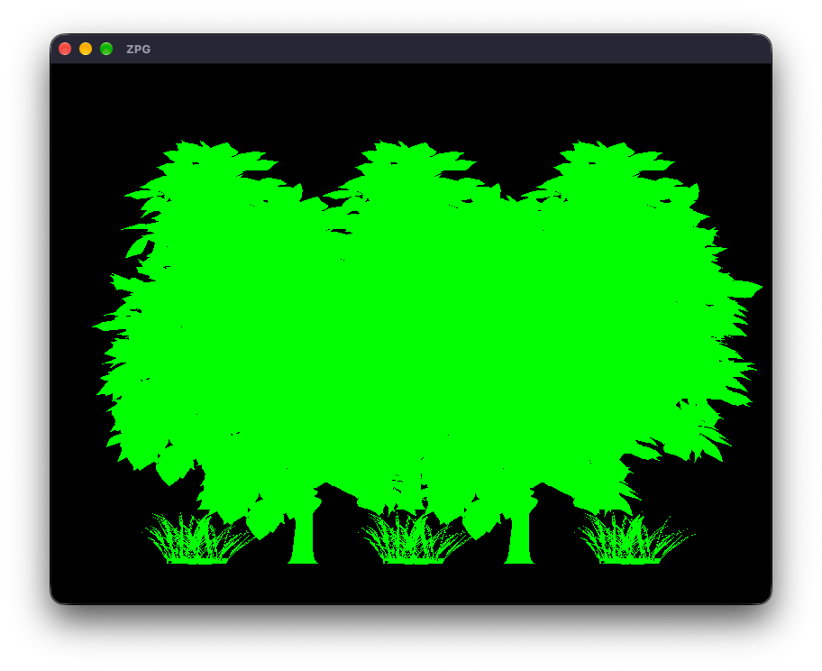
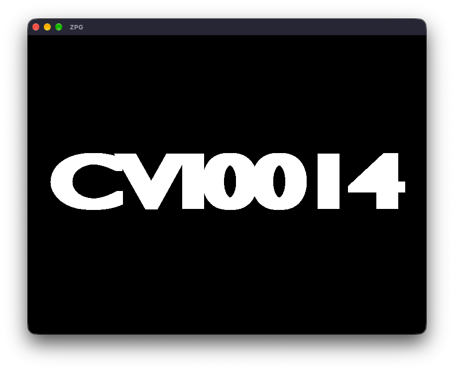
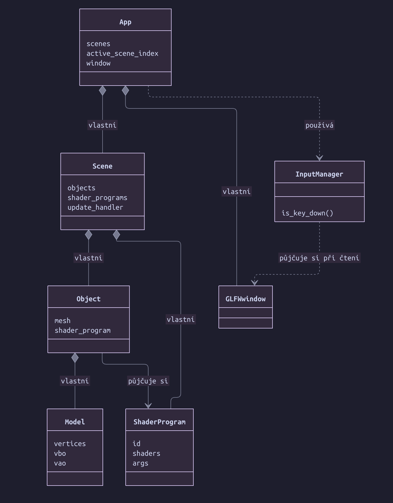
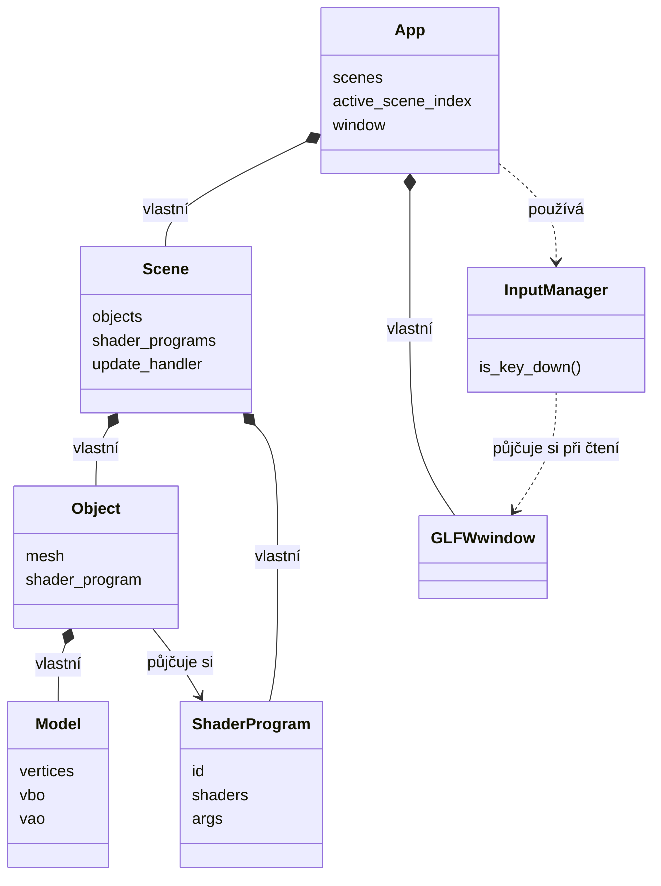

# Cvičení 2

## 1

Splněno v `shaders/basic.vert`.

## 2

Splněno v `shader_program.hpp` a `shader_arg.hpp`.

## 3

Splněno v `scene.hpp` a `main.cpp`.

## 4

Splněno.

## 5

Splněno v `main.cpp`.

## 6

Splněno.

## 7

Splněno.

## 8

- `App` vlastní scény (`Scene`) a okno GLFW.
- `Scene` vlastní objekty (`Object`), shader programy (`ShaderProgram`) a funkci pro aktualizaci.
- `Object` vlastní `Model` a půjčuje si `ShaderProgram` ze své scény.
- `Model` vlastní vrcholy, `VBO` a `VAO`.
- `InputManager` si při čtení kláves půjčuje okno GLFW.

```mermaid
classDiagram
    class App {
        scenes
        active_scene_index
        window
    }
    class Scene {
        objects
        shader_programs
        update_handler
    }
    class Object {
        mesh
        shader_program
    }
    class Model {
        vertices
        vbo
        vao
    }
    class ShaderProgram {
        id
        shaders
        args
    }
    class InputManager {
        is_key_down()
    }
    class GLFWwindow

    App *-- Scene : vlastní
    App *-- GLFWwindow : vlastní
    Scene *-- Object : vlastní
    Scene *-- ShaderProgram : vlastní
    Object *-- Model : vlastní
    Object --> ShaderProgram : půjčuje si
    App ..> InputManager : používá
    InputManager ..> GLFWwindow : půjčuje si při čtení
```
